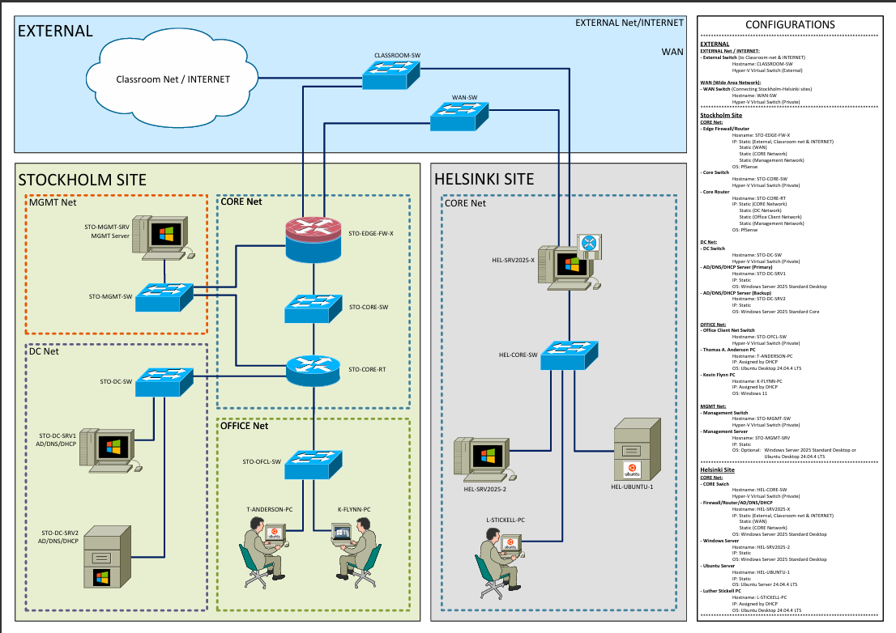

# Multi-Site Network Infrastructure Lab

This repository documents a practical network infrastructure lab completed as part of my networking studies.

The lab simulates a multi-site company environment with a Stockholm headquarters site and a Helsinki branch office. The design includes segmented networks, routed site-to-site connectivity, pfSense firewall/router configuration, NAT, Active Directory, DNS, DHCP, NTP, Group Policy Objects, and both Windows and Linux machines.

## What the Lab Demonstrates

* Multi-site network design
* IPv4 subnetting and address planning
* pfSense firewall and routing configuration
* NAT and firewall rule design
* Network segmentation for management, core, datacenter, and office networks
* Windows Server administration
* Active Directory domain setup
* DNS, DHCP, and NTP configuration
* DHCP failover planning
* Group Policy Object configuration
* Linux and Windows workstation integration
* Basic access control planning using OUs and security groups
* Connectivity testing and troubleshooting across segmented networks

## Topology

## Lab Environment

The lab was built using virtual machines and virtual switches, including:

* pfSense firewall/router appliances
* Windows Server domain controllers
* Windows Server Core
* Ubuntu Server
* Windows and Ubuntu workstations
* Separate virtual switches for external, WAN, core, management, datacenter, office, and branch networks

## Key Learning Outcomes

This lab helped me connect networking theory with practical system administration. It required designing and validating routing, DNS, DHCP, firewall rules, NAT behavior, domain membership, access control, and service availability across multiple network segments.

The project strengthened my understanding of how enterprise networks are structured and how different infrastructure services depend on each other.
